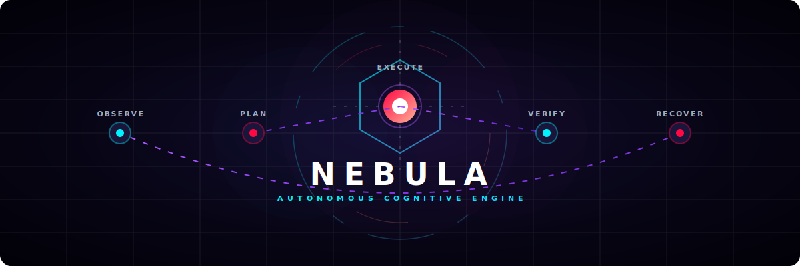
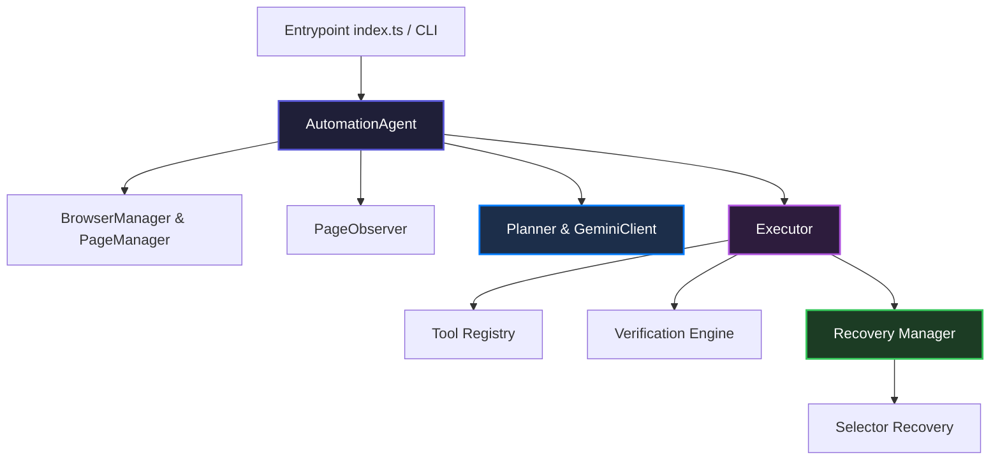

<p align="center">
  
</p>

<p align="center">
  
</p>

<p align="center">
  <strong>Where Web Automation Gains Consciousness.</strong><br />
  <em>A self-healing, agentic web automation engine powered by Google Gemini 2.5 and Playwright.</em>
</p>

<p align="center">
  <a href="#-features"></a>
  <a href="#-architecture"></a>
  
  
</p>


---

### 🌌 The Paradigm Shift

Traditional browser automation scripts are inherently fragile. A single minor class name shift, A/B layout update, or dynamic form modification can break hours of CI/CD pipeline execution.

**Nebula** transforms web automation by replacing brittle, hardcoded selector scripts with **Cognitive Autonomy**. By orchestrating a real-time observation pipeline with Gemini's reasoning layers, Nebula dynamically inspects, plans, executes, verifies, and heals selectors in real-time.

---

## ✨ Features At A Glance

<table width="100%">
  <tr>
    <td width="50%">
      <h4>🧠 Cognitive Planning</h4>
      <p>Formulates step-by-step action plans to achieve complex, multi-stage goals using Gemini 2.5 Flash.</p>
    </td>
    <td width="50%">
      <h4>🛡️ Self-Healing Mechanics</h4>
      <p>Detects execution failures, re-observes structural page context, and dynamically recovers invalid elements.</p>
    </td>
  </tr>
  <tr>
    <td width="50%">
      <h4>👁️ Real-Time Observation</h4>
      <p>Builds a semantic map of interactive elements (inputs, options, select, buttons) and resolves close associations.</p>
    </td>
    <td width="50%">
      <h4>📊 Performance telemetry</h4>
      <p>Extracts granular timing profiles (Observation, Planning, Verification) saved straight to structured JSON reports.</p>
    </td>
  </tr>
  <tr>
    <td width="50%">
      <h4>📸 Sorted Visual Timeline</h4>
      <p>Cleanly partitions captured screenshots into sorted folders: <code>before/</code>, <code>after/</code>, and <code>failures/</code>.</p>
    </td>
    <td width="50%">
      <h4>🖥️ ASCII Interactive CLI</h4>
      <p>A beautiful terminal startup console that guides targets, outlines timelines, and displays status dashboards.</p>
    </td>
  </tr>
</table>

---

## 🛠️ The Agentic Loop

Nebula executes a continuous, five-stage state machine loop to guarantee absolute reliability.

```
       ┌───────────────────────┐
       │     1. OBSERVE        │ ◄─── (Page state parsed to structural JSON)
       └──────────┬────────────┘
                  │
                  ▼
       ┌───────────────────────┐
       │       2. PLAN         │ ◄─── (Gemini generates validated action lists)
       └──────────┬────────────┘
                  │
                  ▼
       ┌───────────────────────┐
       │     3. EXECUTE        │ ◄─── (Playwright executes targeted action)
       └──────────┬────────────┘
                  │
                  ▼
       ┌───────────────────────┐
       │     4. VERIFY         │ ◄─── (Action outcomes evaluated in DOM)
       └──────────┬────────────┘
                  │
                  ▼
       ┌───────────────────────┐
 ┌────►│     5. RECOVER        │ ◄─── (Self-healing recovers selectors)
 │     └───────────────────────┘
 └─────────────────┘
```

---

## ⚡ Quick Start

<details>
<summary>📂 Click to Expand: installation & Configuration</summary>

### 1. Prerequisites
Ensure you have [Node.js](https://nodejs.org/) (v18+) installed.

### 2. Setup
Clone the repository and install dependencies:
```bash
git clone https://github.com/Sid13SST/Nebula.git
cd Nebula
npm install
```

### 3. Environment Config
Configure your environment variables:
```bash
cp .env.example .env
```
Open `.env` and set your Google Gemini API key:
```env
GEMINI_API_KEY=your_gemini_api_key_here
```
</details>

<details>
<summary>🎬 Click to Expand: Running Interactive CLI & Demo Loops</summary>

### 🎬 Run End-to-End Self-Healing Demo
Navigates to Shadcn Forms, injects an intentionally incorrect selector, and showcases self-healing selector correction and verification in real-time:
```bash
npm run demo
```

### 🎮 Run Interactive CLI
Prompts you for target URL and goal inputs directly from your console:
```bash
npm run cli
```

### 🧪 Run Playwright Tool Pipeline
```bash
npm run run-demo
```

### 📦 Build TS Code
```bash
npm run build
```
</details>

---

## 🧬 System Architecture

Nebula is built with strict modularity, conforming to **SOLID** design principles and clean architecture.



*   **Observation Pipeline**: Extracts interactable components, groups matching input-label nodes, and formats page states into minified, token-efficient JSON documents.
*   **Planning Layer**: Instructs Gemini to evaluate goal outcomes against the observation, creating schemas of executable actions.
*   **Execution & Verification**: Executes step actions, takes visual snapshots, and asserts successful changes.
*   **Self-Healing Recovery**: If verification fails, selector recovery resolves fallback strategies (ARIA labels, text matches, input parents) to heal execution dynamically.

---

## 📚 Academic & Defense Documentation

Explore our dedicated guides for detailed reviews, project defenses, and design briefs:

*   📐 [Architecture Design Specifications](docs/Architecture.md) — Under-the-hood structural layout and design models.
*   🔄 [Agentic Orchestration Workflow](docs/AgentWorkflow.md) — State-by-state execution logs and decision flows.
*   🩹 [Self-Healing & Recovery Systems](docs/RecoverySystem.md) — Technical details of our selector recovery algorithm.
*   🎓 [Academic VIVA Study & Defense Guide](docs/VIVA_GUIDE.md) — Deep dive Q&A preparation for academic panels.

---

<p align="center">
  Generated with 🌌 <b>Nebula</b> — Autonomous Browser Intelligence.
</p>

