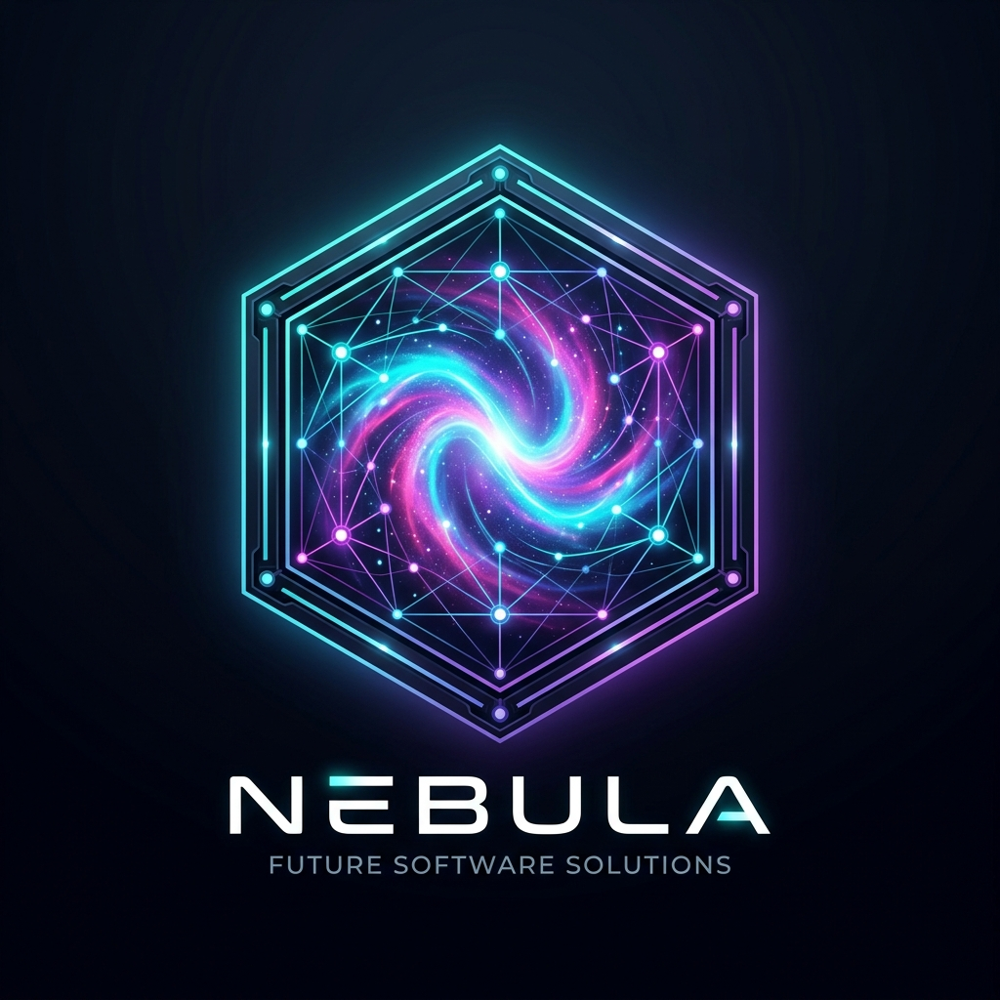
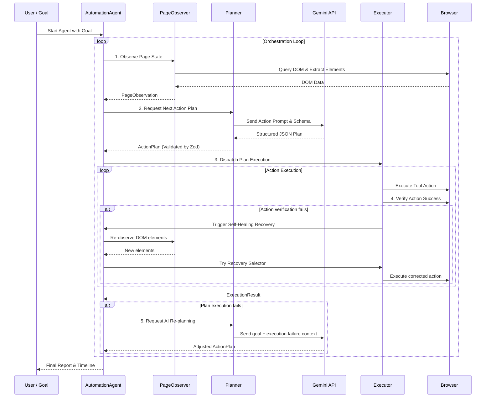

  

# 🔄 Nebula Agent Workflow

Nebula orchestrates browser interactions through an autonomous, reactive loop: **Observe -> Plan -> Execute -> Verify -> Recover -> Re-plan**.

## Step-by-Step Workflow

### 1. Observe Page
- Navigates target page and queries visible elements.
- Captures a "before" screenshot saved under `/screenshots/before/`.

### 2. Plan
- Generates prompt combining current URL, page title, interactive inputs, and user goal.
- Submits structured JSON request to Gemini client.
- Zod schema validates plan attributes.

### 3. Execute
- Dispatches planned actions via the Executor tool registry.
- Checks preconditions (selector visibility, parameter types).

### 4. Verify & Self-Heal
- Passes action outcomes to the verification engine.
- If verification fails (e.g. selector mismatch), triggers selector recovery.
- If selector recovery is successful, executes corrected actions.

### 5. AI Re-planning
- If execution remains unsuccessful, triggers a re-plan.
- Sends the failure message and new observation back to Gemini to obtain an adjusted plan.

### 6. Completion
- Finalizes metrics tracking.
- Generates `/reports/report.json` and sorts screenshots under `/screenshots/after/` or `/screenshots/failures/`.
