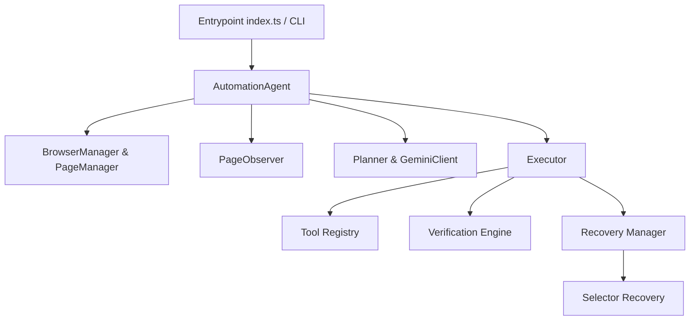

  

# 📐 Nebula System Architecture

Nebula is structured around a decoupled, modular design that strictly separates core browser state management from execution tools, cognitive planning, and self-healing systems.

## Component Overview

### 1. Browser & Page Management (`src/browser/`)
- **BrowserManager**: Singleton orchestrator managing Playwright's Chromium browser, browser context, and active pages.
- **PageManager**: Utility wrapper over Playwright Page object providing navigation, reload, URL queries, and standardized wait-states.

### 2. Tool Layer (`src/tools/`)
- Encapsulates discrete browser actions (`openBrowser`, `navigateToUrl`, `clickOnScreen`, `doubleClick`, `sendKeys`, `scroll`, `takeScreenshot`) as standalone typed functions.
- Every tool returns a standardized `ToolResult` interface and raises a `BrowserError` upon execution failure.

### 3. Observation Engine (`src/observation/`)
- **ElementExtractor**: Evaluates page DOM to locate visible inputs, buttons, textareas, selects, and checkboxes. Builds robust locator path priorities (ID -> Name -> Aria-Label -> Placeholder -> Fallback CSS Path).
- **FormDetector**: Maps input fields to corresponding layout labels using `<label for="id">`, nested elements, or ARIA labelling properties.
- **PageObserver**: Orchestrates document titles, active URLs, timestamps, and extracted element matrices.

### 4. AI Planning Layer (`src/llm/` & `src/agent/planner.ts`)
- **GeminiClient**: Wrapper around `@google/generative-ai` calling model `gemini-2.5-flash` with support for schema-enforced structured JSON responses and backoff retry logic.
- **Planner**: Processes user goals and page observations, substitutes parameters in prompts, queries Gemini, and validates outputs using Zod.

### 5. Action Execution Engine (`src/agent/executor.ts`)
- Dispatches planned actions using a registry mapping action types to tools.
- Executes actions, validates inputs before execution, and runs exponential backoff retries.

### 6. Self-Healing & Recovery (`src/recovery/`)
- **VerificationEngine**: Asserts that browser actions achieved their intended state.
- **SelectorRecovery**: Analyzes current observations to find alternative selectors via label, name, and ID substring matching.
- **RecoveryManager**: Integrates re-observation, selector fallback, and AI replanning.
